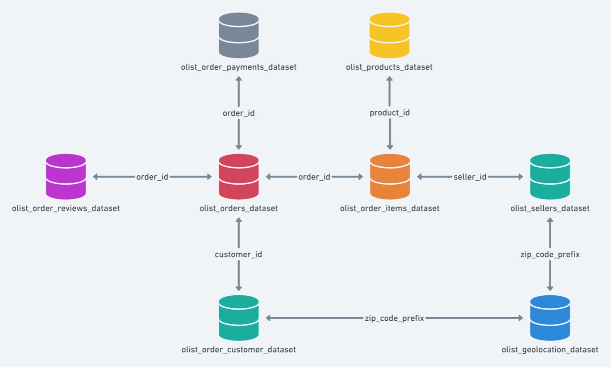
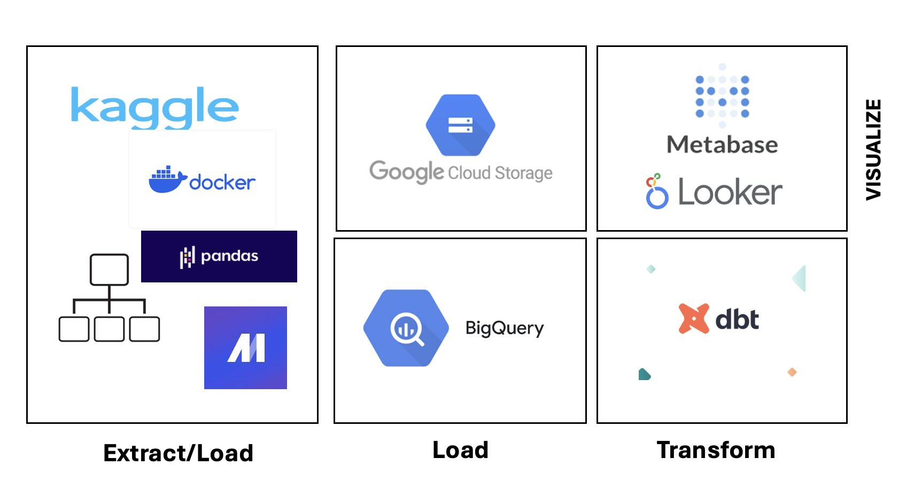

## About the Dataset

Brazil Olist Customers, Sellers and Marketing Data

Olist is a Brazilian e-commerce platform that connects small and medium-sized businesses to customers. The platform operates as a marketplace, where merchants can list their products and services and customers can browse and purchase them online.

And the dataset taken is the public dataset of orders made at Olist Stores. The dataset has information of 100k orders from 2016 to 2018 made at multiple marketplaces in Brazil. Its features allows viewing an order from multiple dimensions: from order status, price, payment and freight performance to customer location, product attributes and finally reviews written by customers. This is real commercial data, it has been anonymised, and references to the companies and partners in the review text have been replaced with the names of Game of Thrones great houses.

> <https://www.kaggle.com/datasets/olistbr/brazilian-ecommerce?resource=download>
>
> <https://www.kaggle.com/datasets/olistbr/marketing-funnel-olist>

## Use Cases that can be solved with this dataset are

- Customer Dimension 

  - Customer Life Time Orders Count

  - Customer Life Time Value

  - Date-wise orders of Customers

- Seller Dimension

  - Increase in number of sellers per month

  - Number of new Product categories added per month

  - Categories Purchased at high frequency yearly, monthly

- Stores Dimension

  - Olist Stores Geo Distribution

- Marketing Impact on

  - Addition of new Sellers

  - Addition of new Customers

  - Addition of new Orders

# E2E Pipeline Explained

  * Mage as an Orchestrator
  * Mage DataLoader uses Kaggle API to load the Kaggle Dataset. (Please note Kaggle OAuth Key is required)
  * The CSVs of data is unzipped into the filesystem
  * Pandas is used to ingest the CSV data into GCS Buckets through 'Data Exporter'
  * Data is taken from GCS Bucket and ingested into BigQuery Data Lake through 'Data Exporter'
  * DBT is leveraged to do transformations and generate new tables & views for the Customers, Sellers dimension

# Additional Tools Used

  * DBT Packages - CodeGen
  * DBT Packages - DBT Utils

# High Level Design**

# Run with Docker Mage + BQ & GCS Bucket 

  ## Perquisites

    1.	A Google Project with free tier – 
    2.	Following API and Services needs to be enabled on the Google Project
        1. BigQuery API
        2. BigQuery Storage API
        3. Identity and Access Management (IAM) API
        4. Compute Engine API
    3.	Service Account
        1.	Goto IAM & Admin. Configure the following Permissions required
          i.	Owner
          ii.	BigQuery Admin
          iii.	BigQuery Read Session User
          iv.	Storage Admin
          v.	Storage Folder Admin
          vi.	Storage Object Admin
          vii.	Compute Storage Admin
    4.  Terraform
        1. In GCP Cloud Storage, bucket has to be created
        2. In BigQuery, Dataset has to be created (olist)
        3. Run the following terraform commands. Please provide the proper project name in variables.tf
          1. terraform init
          2. terraform fmt
          3. terraform validate
          4. terraform plan  -var gcpkey=<Path to ServiceAccount.JSON>
          5. terraform apply  -var gcpkey=<Path to ServiceAccount.JSON>

  ## Clean Up

    1. Destroy the resources created through terraform 
      1. terraform destroy  -var gcpkey=<Path to ServiceAccount.JSON>

# Steps to reproduct locally

  - Git Clone the Repository from
      <https://github.com/clicksuku/sundarkp-olist-commerce.git>

  - Build the MAGE_SPARK Image from the DockerFile

    - Goto the folder in which the 'Dockerfile' is present
    - Docker build -t mage_spark .

  - Create a folder, say SundarkpOlist, where the mage pipeline is going to reside and run

  - Copy the Service Account.JSON [Generate Service Account JSON](https://cloud.google.com/iam/docs/keys-create-delete)

  - Copy the Kaggle Account.JSON here [How to Generate Kaggle API JSON](https://www.kaggle.com/docs/api)
  
  - Run docker command to initiate mage. In the following, a Mage Project 'skpmagepipeline' is created in the following

      > *docker run -d -t --name skp_mage_spark -e
      > SPARK_MASTER_HOST='local' -p 6789:6789 -v \$(pwd):/home/src mage_spark
      > /app/run_app.sh mage start skpmagepipeline*

  - Run <http://localhost:6789/>

  - Import the Pipeline as ZIP file from Git Clone folder - skpdezolist.zip
  
  - Open Pipeline skpdezolist in Mage Editor Mode

  - CD to *skpmagepipeline/dbt*

  - Copy the skp_olist_data_dbt from the git clone folder to skpmagepipeline/dbt

  - Run each step in the pipeline 

  - The steps as explained about, pulls data from Kaggle, ingests into bucket. Creates Tables and views in Dataset. DBT Models are run to generate new tables.  

# Visualizations and Analysis

    [Link to Visualizations and Analysis
    BI](https://github.com/clicksuku/sundarkp-olist-commerce/blob/main/VisualizationsBI.md)

# My Learning and Notes

[Link to My Learning and Notes[def]
BI](LearningNotes/SundarkpDEZoomCampNotes.pdf)

# References

**Spark Cluster in Docker (Did not use as Spark was creating a Unnamed:0
Column)**

[<u>https://docs.mage.ai/integrations/spark-pyspark#custom-spark-session-at-the-project-level</u>](https://docs.mage.ai/integrations/spark-pyspark#custom-spark-session-at-the-project-level)

[<u>https://medium.com/@MarinAgli1/setting-up-a-spark-standalone-cluster-on-docker-in-layman-terms-8cbdc9fdd14b</u>](https://medium.com/@MarinAgli1/setting-up-a-spark-standalone-cluster-on-docker-in-layman-terms-8cbdc9fdd14b)

**Kaggle Datasets**

[<u>https://medium.com/mcd-unison/using-the-kaggle-api-e43e902fba23</u>](https://medium.com/mcd-unison/using-the-kaggle-api-e43e902fba23)

[<u>https://www.kaggle.com/docs/api</u>](https://www.kaggle.com/docs/api)

**Terraform remote exec -**

<https://medium.com/google-cloud/terraform-remote-exec-on-google-compute-engine-vm-instance-d47def447072>

[<u>https://github.com/Sayed-Imran/Terraform-Scripts</u>](https://github.com/Sayed-Imran/Terraform-Scripts)

[<u>https://github.com/Sayed-Imran/Terraform-Scripts/tree/master/gcp-remote-exec</u>](https://github.com/Sayed-Imran/Terraform-Scripts/tree/master/gcp-remote-exec)

[<u>https://gist.github.com/smford22/54aa5e96701430f1bb0ea6e1a502d23a#file-main-tf</u>](https://gist.github.com/smford22/54aa5e96701430f1bb0ea6e1a502d23a#file-main-tf)
[<u>https://www.devopsschool.com/blog/terrafrom-example-code-for-remote-exec-provisioner/</u>](https://www.devopsschool.com/blog/terrafrom-example-code-for-remote-exec-provisioner/)

**Mage for BigQuery**

[<u>https://github.com/mage-ai/mage-ai/blob/master/mage_integrations/mage_integrations/destinations/bigquery/README.md</u>](https://github.com/mage-ai/mage-ai/blob/master/mage_integrations/mage_integrations/destinations/bigquery/README.md)

[<u>https://datatalks-club.slack.com/archives/C01FABYF2RG/p1711711901567119</u>](https://datatalks-club.slack.com/archives/C01FABYF2RG/p1711711901567119)

# Top Issues

- Kaggle initialisation in Mage Data Loader was an issue

  - Conda was installed in Docker.

  - Kaggle and other Python libraries were installed in the Conda Active
    environment.

  - So when Conda was not installed and python libraries were installed.
    Data Loader was able to find Kaggle

- Spark Initialization in Mage Data Loader was an Issue

  - DockerFile was created using
    [<u>https://medium.com/@MarinAgli1/setting-up-a-spark-standalone-cluster-on-docker-in-layman-terms-8cbdc9fdd14b</u>](https://medium.com/@MarinAgli1/setting-up-a-spark-standalone-cluster-on-docker-in-layman-terms-8cbdc9fdd14b)

  - Spark session had to be initialized using ScratchPad as mentioned in
    [<u>https://docs.mage.ai/integrations/spark-pyspark#custom-spark-session-at-the-project-level</u>](https://docs.mage.ai/integrations/spark-pyspark#custom-spark-session-at-the-project-level)

- BigQuery tables had ‘Unnamed:0’ as index column.

  - Spark Read CSV to PD.DataFrame added an index column.

  - Referring to
    [<u>https://sparkbyexamples.com/pandas/pandas-drop-index-column/</u>](https://sparkbyexamples.com/pandas/pandas-drop-index-column/)
    and
    [<u>https://www.kaggle.com/discussions/general/354943</u>](https://www.kaggle.com/discussions/general/354943),
    following were done to remove index

    - pdf = df.toPandas()

    - pdf2 = pdf.reset_index(drop=True)

# Credits

    - Brazilian E-Commerce Company Olist's public Dataset hosted at Kaggle. 
